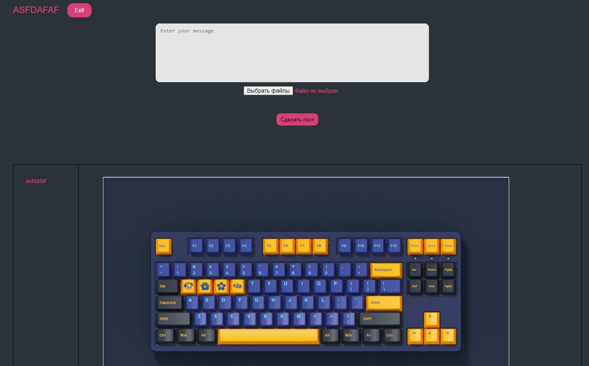

 Реализация шаблона CRUD
------
## Цель работы
Разработать и реализовать клиент-серверную информационную систему, реализующую мехнизм CRUD.

## Задание
Система представляет собой веб-страницу с лентой заметок и форму добавления новой заметки. Система должна обладать следующим функционалом:
- Добавление текстовых заметок в общую ленту
- Реагирование на чужие заметки (лайки)

## Ход работы
Интерфейс



Пользовательский сценарий

    Пользователь попадает на страницу login.php на которой он может войти либо перейти на страницу registration.php на которой он может зарегистрироваться.
    Дальше происходит редирект на main.php, где изображена лента постов.
    Пользователь может добавить свой пост, который может содердать как текст, так и изображение.
    Есть возможность ставить лайки

API сервера

В основе приложения использована клиент-серверная архитектура. Обмен данными между клиентом и сервером осуществляется с помощью HTTP POST запросов.  Для увеличения счётчика реакции используется форма с POST запросом

Хореография

    Отправка сообщения. Принимается введенное сообщение. Отправляется запрос на добавление сообщения в базу данных. Затем происходит обновление страницы. Из базы данных выводится данный пост с картинкой если она была добавлена.
    Просмотр и оценка сообщений. Кнопка like вызывает отправление запроса в базу данных на изменение количества лайков на определенном id сообщения.


Хореография
Структура базы данных
#### `users`

- **id** - уникальный идентификатор пользователя (int);
- **mail** - почта пользователя (varchar(100));
- **login** - имя пользователя (varchar(100));
- **pass** - хэш пароля (varchar(60));

#### `posts`


- **id** - уникальный идентификатор заметки (int);
- **user** - имя пользователя(автора), кто написал заметку (varchar(100));
- **text** - текст заметки (text);
- **likes** - колличество лайков для данного поста (int(100));
- **image** - изображение для данного поста (longblob);

#### `posts_like`

- **id_post** - идентификатор поста к которому был поставлен лайк (varchar(255));
- **id_user** - идентификатор пользователя который поставил лайк (varchar(255));


Значимые фрагменты кода


Отправка сообщения

```
$text = filter_var(trim($_POST['message']), FILTER_SANITIZE_STRING);
$user = $_COOKIE['user'];
//addslashes  Возвращает строку с обратным слешом перед символами, которые нужно экранировать.
//file_get_contents() возвращает содержимое файла в строке, начиная с указанного смещения offset и до length байт

if ($_FILES && $_FILES['file']['error']== UPLOAD_ERR_OK) {
    $image = addslashes(file_get_contents($_FILES['file']['tmp_name']));

    $mysql_posts = new mysqli('localhost', 'root', 'root', 'login_form');
    $mysql_posts->query("INSERT INTO `posts` (`user`,`text`, `likes`, `dislikes`, `image`) VALUES ('$user', '$text', '0', '0', '$image')");

    header('Location: /lab_2_anton/main.php');

} else {
    $mysql_posts = new mysqli('localhost', 'root', 'root', 'login_form');
    $mysql_posts->query("INSERT INTO `posts` (`user`,`text`, `likes`, `dislikes`, `image`) VALUES ('$user', '$text', '0', '0', '')");

    header('Location: /lab_2_anton/main.php');
}
```

Вывод изображения

``` 
if ($user['image'] > 0) {
    $image = base64_encode($user['image']);
    $show_image = '';
} else {
    $show_image = '';
}
```

Вывод сообщений

``` 
$connect = mysqli_connect('localhost', 'root', 'root', 'login_form');
$mysql = mysqli_query($connect, "SELECT * FROM `posts` order by id desc");
$count = 0;

if($mysql->num_rows > 0) {
    while ($row = $mysql->fetch_assoc()) {
        if($count <= 100) {
            $user = $row;
            $user_id = $user['id'];
            $user_id = (int)$user_id;

            if ($user['image'] > 0) {
                $image = base64_encode($user['image']);
                $show_image = '';
            } else {
                $show_image = '';
            }

            $post =  '
                            <div class="news">
    <div class="news__avatar">
        
    </div>
    <div class="news__content">
        <h3 class="news__user">'.htmlspecialchars($user['user']).'</h3>
        '. $show_image .'
        <p class="news__text">'.htmlspecialchars($user['text']).'</p>
        <div class="feedback">
            <form action="Like.php" method="post">
                <input type="hidden" value="'.$user_id.'" name="post_id">
                <button type="submit" class="like" name="like">
                    
                    <p class="counter__like">'.htmlspecialchars($user['likes']).'</p>
                </button>
            </form>
            <form action="dislike.php" method="post">
                <input type="hidden" value="'.$user_id.'" name="post_id_dislike">
                <button type="submit" class="dislike" name="dislike">
                    
                    <p class="counter__dislike">'.htmlspecialchars($user['dislikes']).'</p>
                </button>
            </form>
        </div>
    </div>
</div>
                            '."\n";

            echo $post;
            $count++;
        }
    }
}
```

Вывод

В ходе выполнения лабораторной работы была разработана система клиент-сервер, реализующую механизм CRUD. Был создан форум, в котором пользователи могут: оставлять записи, ставить реакции.